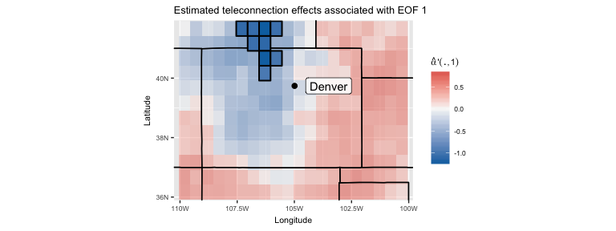
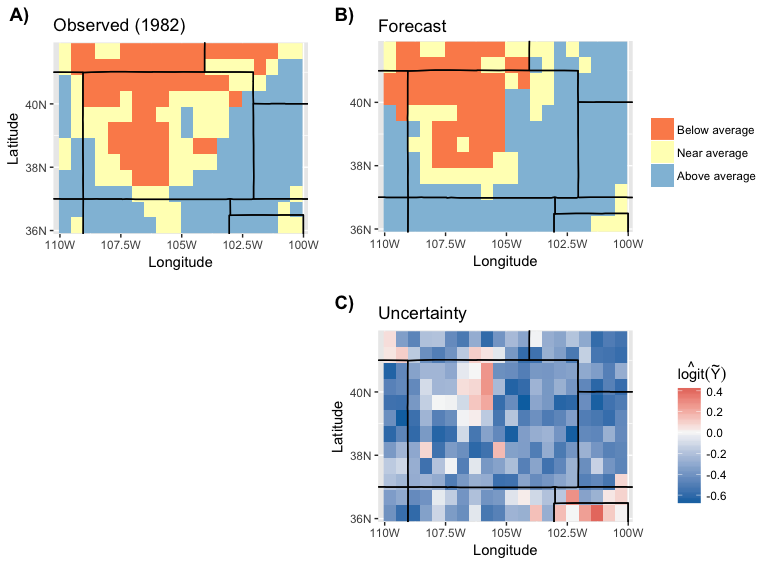

At a glance
===========

-   Demonstrate the `telefit` package's implementation of the [RESP model](https://arxiv.org/abs/1612.06303){:target="\_blank"}.
-   Reproduce figures and tables in the article linked above.
-   Download the code as a [script file](../files/resp/resp_example.R).
-   Download the [data (resp\_coex.RData)](https://figshare.com/s/9dc8c814353578d2460c){:target="\_blank"}.

Introduction
============

We fit the RESP model to average monthly precipitation over Colorado in winter, as described [here](https://arxiv.org/abs/1612.06303){:target="\_blank"}. The R package `telefit` [(hosted on Github)](https://github.com/jmhewitt/telefit){:target="\_blank"} implements the RESP model. Basic use of the `telefit` package is demonstrated below.

You may need to install a few packages before proceeding and you can use the `devtools` package to install `telefit`. The `telefit` package has several dependencies and uses C++; it may take several minutes to install.

``` r
# simple looping
if (!require("foreach")) install.packages("foreach")

# parallelization
if (!require("doMC")) install.packages("doMC")
if (!require("doRNG")) install.packages("doRNG")

# data manipulation and plotting
if (!require("dplyr")) install.packages("dplyr")
if (!require("ggplot2")) install.packages("ggplot2")
if (!require("cowplot")) install.packages("cowplot")

# MCMC tools
if (!require("coda")) install.packages("coda")

# RESP model
if (!require("devtools")) install.packages("devtools")
if (!require("telefit")) devtools::install_github('jmhewitt/telefit')
```

Data
====

Load the example data [resp\_coex.RData](https://figshare.com/s/9dc8c814353578d2460c){:target="\_blank"} in an R session. The `dat` object contains the response variable
(precipitation) and covariates. Other objects contain settings and sample model output. The `dat.test` and `dat.train` objects are associated with `fcst.test` and `fit.train`, which are used later to illustrate posterior predictions.

``` r
load('resp_coex.RData')
str(dat)
```

    ## List of 9
    ##  $ tLabs   : chr [1:33] "1981" "1982" "1983" "1984" ...
    ##  $ coords.s: num [1:240, 1:2] -110 -109 -109 -108 -108 ...
    ##   ..- attr(*, "dimnames")=List of 2
    ##   .. ..$ : NULL
    ##   .. ..$ : chr [1:2] "x" "y"
    ##  $ coords.r: num [1:5252, 1:2] -179 -178 -176 -175 -174 ...
    ##   ..- attr(*, "dimnames")=List of 2
    ##   .. ..$ : NULL
    ##   .. ..$ : chr [1:2] "x" "y"
    ##  $ X       : num [1:240, 1:2, 1:33] 1 1 1 1 1 1 1 1 1 1 ...
    ##   ..- attr(*, "dimnames")=List of 3
    ##   .. ..$ : chr [1:240] "1" "2" "3" "4" ...
    ##   .. ..$ : chr [1:2] "(Intercept)" "T"
    ##   .. ..$ : NULL
    ##  $ Y       : num [1:240, 1:33] 0.0422 0.6052 0.4764 -0.4575 -0.4064 ...
    ##  $ Z       : num [1:5252, 1:33] 0.000128 0.000161 0.000187 0.000191 0.000136 ...
    ##  $ X.lab   : chr "TCWV"
    ##  $ Y.lab   : chr "PRISM Precip. (mm)"
    ##  $ Z.lab   : chr "SSTK (K)"
    ##  - attr(*, "class")= chr "stData"

Modeling
========

Fit the RESP model
------------------

The RESP model may take several hours to fit because it is a hierarchical Bayesian spatial model. The file [resp\_coex.RData](https://figshare.com/s/9dc8c814353578d2460c){:target="\_blank"} contains sample (sub)model output `fit`, `fit.local`, `fit.remote` if you want to skip this step.

``` r
# sampler parameters (Note: cov.r "nugget" is not currently estimated)
maxIt = 21000
burn = 1000
priors = list(
  beta = list( Lambda = diag(10, ncol(dat$X[,,1]))), 
  cov.s = list( smoothness = .5, range = c(1, 600), variance = c(2, 30), 
                nugget = c(2, 1) ),
  cov.r = list( smoothness = .5, range = c(1, 600), variance = c(2,1e-1), 
                nugget = c(2,1) )
)

# parallelize estimation of (sub)models
ncores = detectCores() - 1
registerDoMC(ncores)

# fit (sub)models in parallel
ret = foreach(i=1:3) %dorng% {
  if(i==1) { # RESP model
    stFit(dat, priors, maxIt, coords.knots = coords.knots)
  } else if (i==2) { # SP submodel
    stFit(dat, priors, maxIt, coords.knots = coords.knots, localOnly = T)
  } else if (i==3) { # RE submodel
    stFit(dat, priors, maxIt, coords.knots = coords.knots, remoteOnly = T)
  }
}

# extract model fits
fit = ret[[1]]
fit.local = ret[[2]]
fit.remote = ret[[3]]
rm(ret)
```

The `telefit` package saves posterior samples of the RESP model's mean and
covariance parameters. Teleconnection effects are estimated separately, via composition sampling as spatial random effects. The posterior predictive distribution is also sampled via composition. Posterior predictive samples for `fcst`, `fcst.local`, and `fcst.remote` are not included in [resp\_coex.RData](https://figshare.com/s/9dc8c814353578d2460c){:target="\_blank"} to reduce the file's size. However, posterior sampling is relatively quick because it is easily parallelized.

``` r
# posterior parameter samples
str(fit$parameters$samples)
```

    ## List of 8
    ##  $ beta         : num [1:21000, 1:2] -0.08832 -0.03911 0.00985 -0.07779 -0.01186 ...
    ##  $ sigmasq_y    : num [1:21000, 1] 0.186 0.178 0.186 0.223 0.215 ...
    ##  $ sigmasq_r    : num [1:21000, 1] 1.84 1.93 1.93 1.93 1.93 ...
    ##  $ sigmasq_r_eps: num [1:21000, 1] 0 0 0 0 0 0 0 0 0 0 ...
    ##  $ sigmasq_eps  : num [1:21000, 1] 0.724 0.682 0.492 0.492 0.436 ...
    ##  $ rho_y        : num [1:21000, 1] 342 322 322 310 263 ...
    ##  $ rho_r        : num [1:21000, 1] 186 189 212 212 240 ...
    ##  $ ll           : num [1:21000, 1] -3058 -3274 -3970 -3164 -3405 ...

``` r
# estimate teleconnection effects and make predictions
fcst.local = stPredict(stFit = fit.local, stData = dat, 
                       stDataNew = dat, burn = burn, ncores = ncores)
fcst.remote = stPredict(stFit = fit.remote, stData = dat, stDataNew = dat, 
                        burn = burn, ncores = ncores, returnFullAlphas = F)
fcst = stPredict(stFit = fit, stData = dat, stDataNew = dat, burn = burn, 
                 ncores = ncores, returnFullAlphas = T)
```

Evaluate the RESP model
-----------------------

The `stEval()` function in `telefit` evaluates predictions with respect to several measures. Variance inflation factors are also included in the `stVIF()` function.

``` r
# evaluate predictions
clim = rowMeans(dat$Y)
fcst = stEval(fcst, dat$Y, clim)
fcst.local = stEval(fcst.local, dat$Y, clim)
fcst.remote = stEval(fcst.remote, dat$Y, clim)

# look at errors for predictions at first timepoint
str(fcst$pred[[1]]$err)
```

    ## List of 10
    ##  $ mspe          : num 0.614
    ##  $ ppl           : num 160
    ##  $ r2            : num -0.0234
    ##  $ cor           : num -0.0411
    ##  $ coverage      : num 0.867
    ##  $ cat.correct   : num 0.246
    ##  $ cat.heidke    : num -0.105
    ##  $ cat.heidke.alt: num -0.131
    ##  $ crps.cat      : num 0.496
    ##  $ bss           : num -0.00417

``` r
# compute VIFs
vif = stVIF(stData = dat, stFit = fit, burn = 1000)
vif$beta
```

    ## (Intercept)           T 
    ##    1.000000    1.060935

``` r
summary(vif$alpha)
```

    ##    Min. 1st Qu.  Median    Mean 3rd Qu.    Max. 
    ##  0.9588  0.9706  0.9750  0.9767  0.9832  0.9985

Plots and output
================

Teleconnection schematic
------------------------

The `telefit` package supports basic plotting and labeling of climate data.
Complex graphics can be built using additional functions in `ggplot2`.

``` r
# unnormalize data
dat$Z = dat$Z*5252

# set plotting label
dat$Z.lab = 'z'

# set plot year
t = 1982

# build base plot of sea surface temperatures
x = plot(dat, type='remote', t=t, boxsize = 6.5) + ggtitle('')

# re-normalize data
dat$Z = dat$Z/5252

# add local precipitation
x = x + 
  geom_point(aes(x=lon, y=lat, colour = precip), inherit.aes = F, size = .6,
             stroke = 0, pch = 15,
             data = data.frame(lon = dat$coords.s[,1], lat = dat$coords.s[,2],
                               precip = dat$Y[,which(dat$tLabs==t)])) +
  scale_color_distiller('Y', palette = 'PuBuGn', direction = 1) +
  theme(legend.box = 'horizontal',
        legend.box.margin = margin(t=0, r=-8, b=0, l=0, unit='pt'))

# set left endpoints of arrows for schematic
arrows.start = data.frame(
  x = c(-100, -150, -200, -180),
  y = c(-5, 5, 35, 55)
)[c(3,2,1,4),] %>% mutate(x=ifelse(x<=0,x,x-360))

# set arrow color
col = 'forestgreen'

# plot after adding schematic arrows and labels
x + geom_curve(aes(x = x1, y = y1, xend = x2, yend = y2),
               curvature = .3, arrow = arrow(length = unit(0.03, "npc")),
               inherit.aes = F, lwd = 1, col=col,
               data = data.frame(x1=arrows.start$x[1:3],
                                 y1=arrows.start$y[1:3],
                                 x2=dat$coords.s[c(161,187,219),1],
                                 y2=dat$coords.s[c(161,187,219),2])
               ) +
  geom_curve(aes(x = x1, y = y1, xend = x2, yend = y2),
             curvature = -.3, arrow = arrow(length = unit(0.03, "npc")),
             inherit.aes = F, lwd = 1, col=col,
             data = data.frame(x1=arrows.start$x[4],
                               y1=arrows.start$y[4],
                               x2=dat$coords.s[23,1],
                               y2=dat$coords.s[23,2])
             ) +
  geom_point(aes(x=x, y=y), size=3, col=col,
             data = arrows.start, inherit.aes = F, pch=19) +
  geom_label(aes(x=x,y=y,label=label), inherit.aes = F,
             data = data.frame(
               x=c(-185,-110),
               y=c(15,dat$coords.s[94,2]+10),
               label=c('z(r,t)','x(s,t), Y(s,t)')
             ), col=col, size=5)
```


Exploratory teleconnection analysis
-----------------------------------

The `telefit` package also supports basic exploratory data analysis for teleconnection, including functions that compute and plot [empirical orthogonal functions](https://climatedataguide.ucar.edu/climate-data-tools-and-analysis/empirical-orthogonal-function-eof-analysis-and-rotated-eof-analysis){:target="\_blank"} and their correlations with local response variables.

``` r
plot_grid(
  plot(dat, type='eof') +
    ggtitle('SST Empirical orthogonal function 1 (EOF 1)') +
    theme(text = element_text(size=8)),
  plot(dat, type='eof_cor', signif.level = .05, signif.telecon = T,
       lwd=.7, alpha=.6) +
    ggtitle('Correlation between Precip. and EOF 1 score') +
    theme(text = element_text(size=8)),
  ncol=2,
  labels=paste(LETTERS[1:2], ')', sep='')
)
```


RESP Teleconnection estimates
-----------------------------

Of course, the `telefit` package plots posterior estimates of teleconnection effects.

``` r
# build base plot of teleconnection effect estimates
resp = plot(fcst, type='eof_alpha_knots', stFit = fit, stData = dat,
            signif.telecon = T, lwd=0.7, alpha=.6) +
  scale_fill_gradient2(expression(hat(alpha)~"'"(~bold(".")~","~1)),
                       low = "#0571b0", mid = '#f7f7f7', high = '#ca0020') +
  ggtitle('Estimated teleconnection effects associated with EOF 1') 

# plot after adding denver as a point of reference
resp +
  geom_point(aes(x=lon, y=lat), 
             data = data.frame(lon = -104.9903, lat = 39.7392),
             inherit.aes = F, size = 2) + 
  geom_label(aes(x=lon, y=lat, label=label),
             data = data.frame(lon = -103.5, lat = 39.7392, label = 'Denver'),
             inherit.aes = F, alpha = .85) + 
  theme(text = element_text(size=8))
```



Model comparison
----------------

The [resp\_coex.RData](https://figshare.com/s/9dc8c814353578d2460c){:target="\_blank"} file contains model comparison information in the `errs` object.

``` r
# set grouping labels
ilabs = c('Submodels', 'Common models')

# build plot data
errs = errs %>% mutate(model = factor(model, levels = c('RESP', 'RE', 'SP', 
                                                        'SVC', 'ENSO-T', 'CCA', 
                                                        'CLIM')),
         crps.rel = crps.cat / median(errs$crps.cat[errs$model=='CLIM']),
         comp = recode(model, 'RE'=ilabs[1], 'SP'=ilabs[1], 'RESP'='',
                       'SVC'=ilabs[2], 'ENSO-T'=ilabs[2], 'CCA'=ilabs[2], 
                       'CLIM'=ilabs[2]))

# plot error comparison
errs %>% ggplot(aes(x=model, y=crps.rel)) +
  geom_boxplot() +
  geom_hline(yintercept = 1, lty = 2) +
  xlab('') +
  ylab('Relative RPS') +
  scale_y_continuous(breaks = c(.5, 1, 1.5, 2, 3)) +
  facet_grid(~comp, scales = 'free_x', space = 'free_x') +
  theme(strip.background = element_blank(),
        strip.text = element_text(colour = 'gray15'),
        panel.border = element_rect(colour = 'gray60', linetype = 1, size = .5),
        axis.line.y = element_blank(),
        panel.spacing = unit(0, 'pt'))
```


``` r
errs %>% ggplot(aes(x=model, y=cat.heidke.alt)) +
  geom_boxplot() +
  geom_hline(yintercept = 0, lty=2) +
  xlab('') +
  ylab('Heidke skill score') +
  coord_equal(ratio = 2) +
  facet_grid(~comp, scales = 'free_x', space = 'free_x') +
  theme(strip.background = element_blank(),
        strip.text = element_text(colour = 'gray15'),
        panel.border = element_rect(colour = 'gray60', linetype = 1, size = .5),
        axis.line.y = element_blank(),
        panel.spacing = unit(0, 'pt'))
```


Parameter estimates
-------------------

The `coda` package can easily process posterior parameter samples to develop point estimates and credible intervals.

``` r
maxIt = 21e3
burn = 1e3

# extract posterior samples of parameters
params = data.frame(fit$parameters$samples) %>% 
  select(-ll, -sigmasq_r_eps) %>%
  slice(burn:maxIt)
colnames(params)[1:ncol(dat$X)] = colnames(dat$X)

# "unexpand" the nugget parameter
params[,5] = params[,5] * params[,3]

# compute highest posterior density intervals
hpds = HPDinterval(mcmc(params))
hpds = round(hpds, 2)

# compute posterior estimates
ests = round(colMeans(mcmc(params)),2)

# stronger rounding for range parameters
hpds[6:7,] = round(hpds[6:7,], 0)
ests[6:7] = round(ests[6:7], 0)

# assemble parameter estimates table
df = data.frame(
  Param = c('$\\beta_0$', '$\\beta_T$', '$\\sigma^2_w$', '$\\sigma^2_\\alpha$',
            '$\\sigma^2_\\varepsilon$', '$\\rho_w$', '$\\rho_\\alpha$'),
  Est=ests,
  HPD=paste('(', paste(hpds[,1], hpds[,2], sep=', '), ')', sep='')
)

# text formatting
df$Est = gsub('-', '$-$',sprintf('%.2f', df$Est))
df[,1] = as.character(df[,1])
df[,3] = gsub('-','$-$',as.character(df[,3]))

colnames(df) = c('', 'Posterior mean', '95\\% HPD')
rownames(df) = c('Local effects',' ',  '  ', '   ',
                 'Covariance', '    ', '     ')

df
```

    ##                                        Posterior mean          95\\% HPD
    ## Local effects               $\\beta_0$        $-$0.00     ($-$0.1, 0.09)
    ##                             $\\beta_T$        $-$0.19 ($-$0.24, $-$0.14)
    ##                          $\\sigma^2_w$           0.33       (0.31, 0.35)
    ##                    $\\sigma^2_\\alpha$           4.13       (1.07, 8.22)
    ## Covariance    $\\sigma^2_\\varepsilon$           0.03       (0.02, 0.03)
    ##                              $\\rho_w$         178.00         (166, 191)
    ##                        $\\rho_\\alpha$         483.00         (242, 743)

Posterior predictive maps
-------------------------

Sample map of posterior predictions (B) and uncertainty (C), compared to truth (A).

``` r
plot_grid(
  plot(dat.test, fill.lab=expression(Y)) + ggtitle('Observed (1982)'),
  plot(fcst, fill.lab=expression(hat(Y))) + ggtitle('Forecast') +
    theme(axis.title.y = element_text(color='white')),
  NULL,
  plot(fcst, type='se', fill.lab=expression(SE(hat(Y)))) + 
    ggtitle('Uncertainty'),
  ncol=2, labels = c('A)','B)', '', 'C)')
)
```


Similar maps for discretized posterior predictions.

``` r
# compute posterior logits
logits = qlogis(fcst.test$samples$cat_probs)
logits.est = matrix(nrow = nrow(logits), ncol = ncol(logits))
for(i in 1:nrow(logits)) {
  logits.est[i,] = rowMeans(logits[i,,])
}

# transfer logits to a plottable object
logitDat = dat.test
logitDat$Y = apply(logits.est, 1, max) 

# build plots

p = plot(dat.test, type='cat.response', 
         category.breaks = fcst$category.breaks, fill.lab='') +
  ggtitle('Observed (1982)')

uncty = plot(logitDat, fill.lab=expression(hat(logit)(tilde(Y)))) +
  ggtitle('Uncertainty')

# assemble and display plots
ggdraw(plot_grid(
  plot_grid(
    plot_grid(
      p + theme(legend.position = 'none'),
      NULL,
      plot(fcst.test, type='cat.pred', fill.lab='') +
        ggtitle('Forecast') +
        theme(axis.title.y = element_text(color='white'),
              legend.position = 'none'),
      nrow=1, align='v', rel_widths = c(1,.03,1), labels=c('A)','','B)')),
    get_legend(p),
  rel_widths=c(1, 0.2)
  ),
    plot_grid(
    plot_grid(
      NULL,
      NULL,
      uncty + theme(legend.position = 'none'),
      nrow=1, align='v', rel_widths = c(1,.03,1), labels=c('','','C)')),
    get_legend(uncty),
  rel_widths=c(1, 0.2)
  ),
  nrow=2
))
```



Knot locations
--------------

For completeness, we can view the knot locations used during estimation.

``` r
dat$Z.lab = 'SST'
plot(dat, type='remote', coords.knots = coords.knots, t = 1982) +
  ggtitle('')
```


